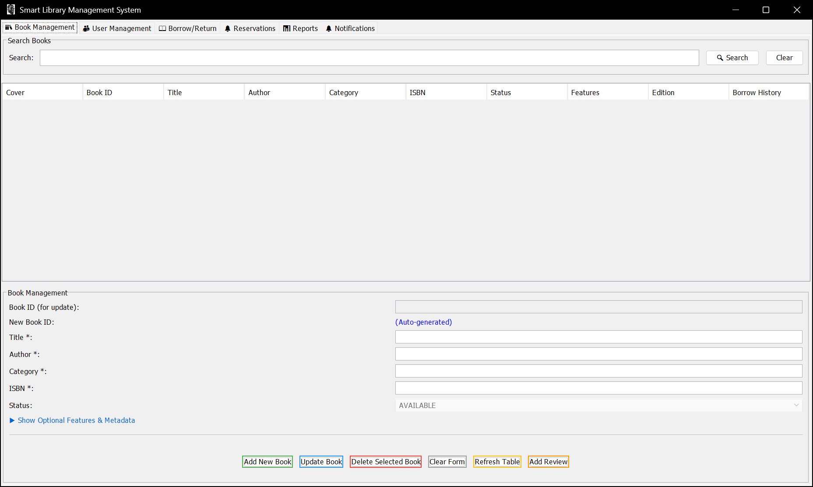
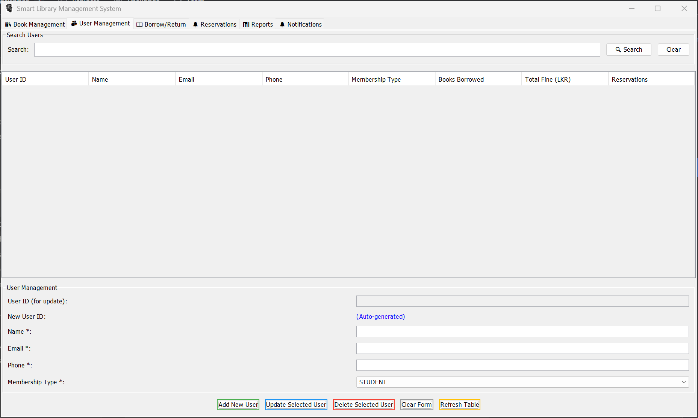
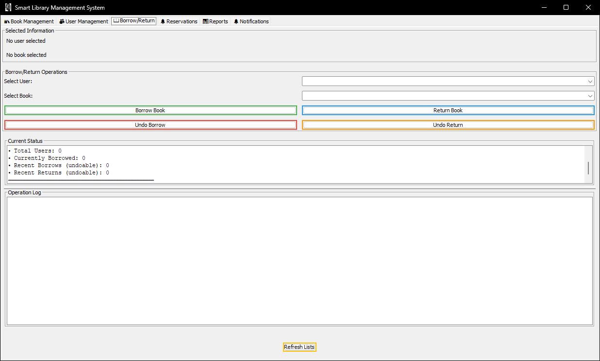
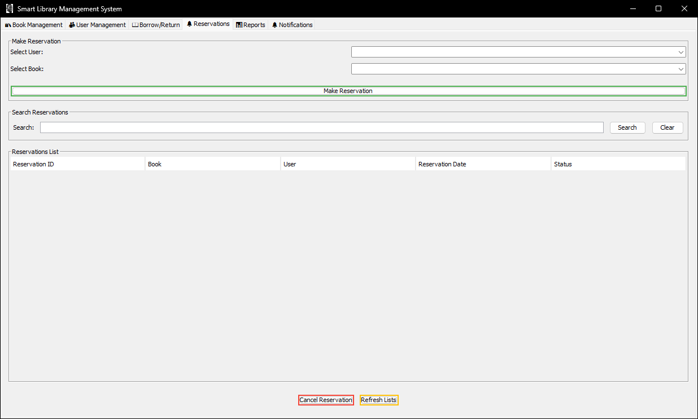
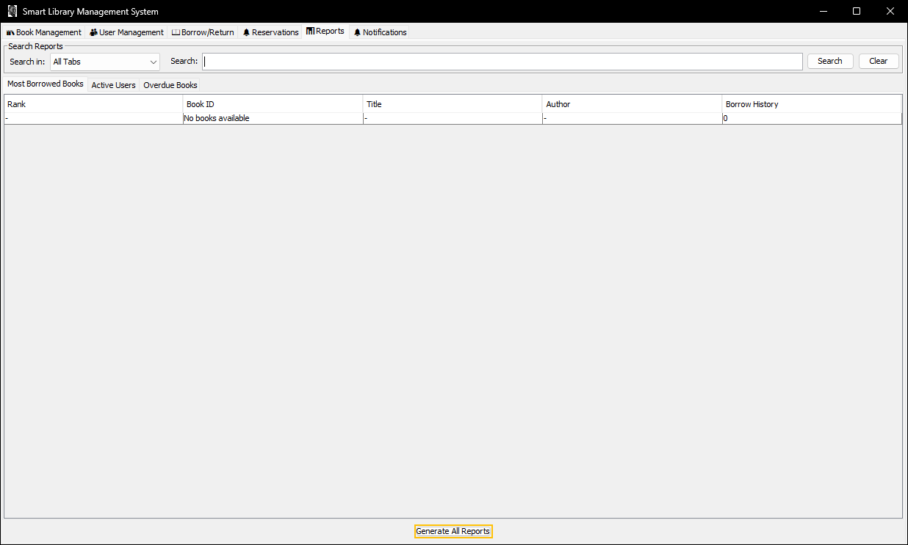
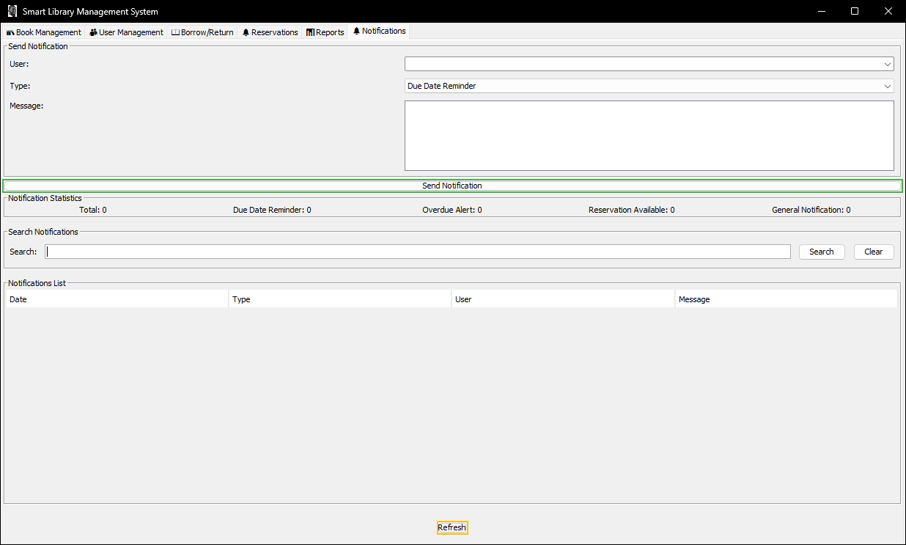
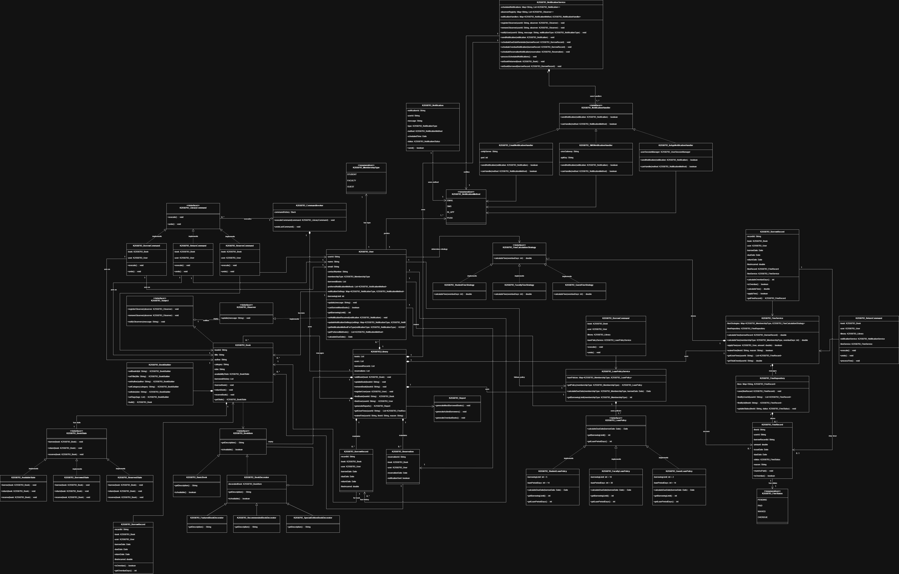

# Smart Library Management System

A Java Swing desktop application for managing a smart library, built around four classic Gang-of-Four design patterns — **Singleton**, **Builder**, **Decorator**, **Observer**, **State**, and **Strategy**. Features include book and user management, borrow/return with undo, reservations, automated email notifications via an SMTP scheduler, overdue fine tracking, and multi-view reports.

---

## Table of Contents

- [Screenshots](#screenshots)
- [Design Patterns](#design-patterns)
- [Features](#features)
- [Membership Types & Rules](#membership-types--rules)
- [Architecture](#architecture)
- [Project Structure](#project-structure)
- [Class Diagram](#class-diagram)
- [Email Notification System](#email-notification-system)
- [Getting Started](#getting-started)
- [Usage Guide](#usage-guide)
- [Tech Stack](#tech-stack)
- [Author](#author)

---

## Screenshots

### 📚 Book Management
Add books with rich metadata — title, author, ISBN, category, publisher, edition, language, page count, description, tags, and cover image path. Mark books as Featured, Recommended, or Special Edition (Decorator pattern). The live table shows colour-coded availability status and star ratings.



---

### 👥 User Management
Register users across three membership tiers (Student, Faculty, Guest), each with different loan periods, borrowing limits, and daily fine rates. The panel also shows per-user borrow history with expandable detail rows.



---

### 📖 Borrow / Return
Select a user and a book from searchable dropdowns. Context panels show live user capacity info and the book's current status. Borrow and return operations are logged in real time. A Stack-backed **Undo** button reverses the last operation.



---

### 🔔 Reservations
Users can reserve a borrowed book and be automatically notified by email when it becomes available (Observer pattern). Reservations expire after 48 hours. The panel displays all active reservations with notification status.



---

### 📊 Reports
Three sub-report views: Most Borrowed Books (ranked), Active Users, and Overdue Books. All tables support live text search and column sorting. Summary stat cards show totals at a glance.



---

### 🔔 Notifications & Email Scheduler
Send manual email notifications or let the automated scheduler handle them. Three background schedulers run continuously — due date reminders, overdue alerts, and reservation expiry checks — all delivered via Outlook SMTP using HTML email templates.



---

## Design Patterns

This project is the core focus of CW2 — each pattern is fully implemented and integrated into real application behaviour:

### 1. Singleton — `LibraryService`, `EmailService`, `NotificationService`, `EmailSchedulerService`
All service classes use a private constructor and a static `getInstance()` method to ensure a single shared instance throughout the application. This guarantees consistent state across all GUI panels.

```java
public static LibraryService getInstance() {
    if (instance == null) {
        instance = new LibraryService();
    }
    return instance;
}
```

### 2. Builder — `BookBuilder`
Constructs `Book` objects step-by-step with a fluent API, separating the construction of complex books (with many optional fields) from their representation.

```java
Book book = new BookBuilder()
    .setTitle("Clean Code")
    .setAuthor("Robert C. Martin")
    .setIsbn("978-0132350884")
    .setCategory("Software Engineering")
    .setEdition(1)
    .setPublisher("Prentice Hall")
    .addTag("programming")
    .addTag("best-practices")
    .build();
```

### 3. Decorator — `FeaturedBookDecorator`, `RecommendedBookDecorator`, `SpecialEditionBookDecorator`
Adds dynamic labelling and behaviour to books without modifying the `Book` class. Decorators wrap a book and augment its display string with badges (⭐ FEATURED, 👍 RECOMMENDED, 🌟 SPECIAL EDITION).

```java
// Chain decorators at runtime
Book book = new FeaturedBookDecorator(
    new SpecialEditionBookDecorator(baseBook, 2, "Annotated with exercises")
);
```

### 4. Observer — `BookSubject` / `BookObserver` (implemented by `User`)
When a borrowed book is returned, `LibraryService` calls `bookSubject.notifyObserver(userId, message)` to alert all users who reserved that book. `User` implements `BookObserver`, triggering both a UI notification and an email dispatch.

```java
// User subscribes to a book
bookSubject.registerObserver(user);

// When book is returned, all registered observers are notified
bookSubject.notifyObservers("The Pragmatic Programmer is now available!");
```

### 5. State — `AvailableState`, `BorrowedState` (via `BookState`)
Book status transitions are managed through the State pattern. Each state defines what actions are legal — e.g., `BorrowedState.borrow()` rejects the operation with a message, while `AvailableState.borrow()` allows it.

```
AVAILABLE ──borrow()──▶ BORROWED ──returnBook()──▶ AVAILABLE
     ▲                                                  │
     └──────────── cancel reservation ─────────────────┘
```

### 6. Strategy — `FineCalculationStrategy` / `StudentFineStrategy`, `FacultyFineStrategy`, `GuestFineStrategy`
Fine rates differ per membership type. Rather than a chain of `if/else` blocks, a strategy map selects the correct algorithm at runtime based on the user's `MembershipType`.

```java
// LibraryService initialises the map on construction
fineStrategies.put(MembershipType.STUDENT, new StudentFineStrategy());   // LKR 50/day
fineStrategies.put(MembershipType.FACULTY, new FacultyFineStrategy());   // LKR 20/day
fineStrategies.put(MembershipType.GUEST,   new GuestFineStrategy());     // LKR 100/day

// At fine calculation time
FineCalculationStrategy strategy = fineStrategies.get(user.getMembershipType());
double fine = strategy.calculateFine(overdueDays);
```

---

## Features

- **Book Management** — Full CRUD with rich metadata: ISBN, edition, publisher, language, page count, description, cover image, tags, additional authors, and star rating
- **Book Labelling** — Decorator pattern adds Featured ⭐, Recommended 👍, and Special Edition 🌟 badges
- **User Management** — Three membership tiers with individual rules for loan period, borrowing limit, and fine rate; per-user borrow history view
- **Borrow / Return** — Capacity-aware borrowing (enforces membership limit); Stack-based undo for last borrow or return
- **Reservations** — Observer-based notification when a reserved book becomes available; 48-hour expiry window
- **Fine Tracking** — Strategy-selected fine calculation; `FineRecord` stores status (PENDING / PAID) per overdue borrow
- **Email Notifications** — HTML email templates sent via Jakarta Mail over Outlook SMTP for due date reminders, overdue alerts, and reservation availability
- **Email Scheduler** — Three concurrent background schedulers (due reminder, overdue alert, reservation expiry) with manual trigger option
- **Reports** — Most Borrowed Books, Active Users, and Overdue Books tables with search and column sorting
- **Notifications Panel** — In-app notification log with type-based statistics cards

---

## Membership Types & Rules

| Membership | Loan Period | Max Books | Fine / Day | Strategy Class |
|---|---|---|---|---|
| Student | 14 days | 5 books | LKR 50 | `StudentFineStrategy` |
| Faculty | 30 days | 10 books | LKR 20 | `FacultyFineStrategy` |
| Guest | 7 days | 2 books | LKR 100 | `GuestFineStrategy` |

---

## Architecture

```
┌──────────────────────────────────────────────────────────────────┐
│                          GUI Layer                               │
│  MainFrame (JFrame)                                              │
│  ├── BookManagementPanel   ├── UserManagementPanel               │
│  ├── BorrowReturnPanel     ├── ReservationPanel                  │
│  ├── ReportsPanel          └── NotificationsPanel                │
└──────────────────────┬───────────────────────────────────────────┘
                       │ calls (Singleton)
┌──────────────────────▼───────────────────────────────────────────┐
│                      Service Layer                               │
│  LibraryService (Singleton)                                      │
│  ├── uses BookSubject (Observer)                                 │
│  ├── uses fineStrategies map (Strategy)                          │
│  └── delegates to EmailSchedulerService (Singleton)             │
│                                                                  │
│  EmailService (Singleton) ── NotificationService (Singleton)    │
│  EmailSchedulerService (Singleton, 3 background threads)        │
└──────────────────────┬───────────────────────────────────────────┘
                       │ manages
┌──────────────────────▼───────────────────────────────────────────┐
│                      Model Layer                                 │
│  Book (Builder / Decorator / State)                              │
│  User (implements BookObserver)                                  │
│  BorrowRecord · FineRecord · Reservation · Review                │
│  PublisherInfo                                                   │
└──────────────────────────────────────────────────────────────────┘
```

---

## Project Structure

```
SmartLibraryManagementSystem/
├── src/main/java/com/library/
│   │
│   ├── MainApp.java                              # Entry point
│   ├── LibraryApplication.java                  # Bootstrap & sample data loader
│   │
│   ├── models/
│   │   ├── Book.java                             # Rich book entity (tags, rating, cover, reservations)
│   │   ├── User.java                             # Implements BookObserver
│   │   ├── BorrowRecord.java                     # Loan record with due/return dates
│   │   ├── FineRecord.java                       # Overdue fine with PENDING/PAID status
│   │   ├── Reservation.java                      # Reservation with 48h expiry
│   │   ├── Review.java                           # Star rating + comment
│   │   └── PublisherInfo.java                    # Publisher metadata
│   │
│   ├── enums/
│   │   ├── MembershipType.java                   # STUDENT, FACULTY, GUEST (with rules)
│   │   ├── BookStatus.java                       # AVAILABLE, BORROWED, RESERVED
│   │   ├── FineStatus.java                       # PENDING, PAID
│   │   └── NotificationType.java                 # DUE_DATE_REMINDER, OVERDUE_ALERT, etc.
│   │
│   ├── patterns/
│   │   ├── builder/
│   │   │   └── BookBuilder.java                  # Fluent builder for Book objects
│   │   ├── decorator/
│   │   │   ├── BookDecorator.java                # Abstract decorator base
│   │   │   ├── FeaturedBookDecorator.java        # Adds ⭐ FEATURED badge
│   │   │   ├── RecommendedBookDecorator.java     # Adds 👍 RECOMMENDED badge
│   │   │   └── SpecialEditionBookDecorator.java  # Adds 🌟 SPECIAL EDITION badge
│   │   ├── observer/
│   │   │   ├── BookSubject.java                  # Maintains observer map; notifies
│   │   │   └── BookObserver.java                 # Interface implemented by User
│   │   ├── state/
│   │   │   ├── BookState.java                    # State interface
│   │   │   ├── AvailableState.java               # Permits borrow/reserve
│   │   │   └── BorrowedState.java                # Permits return/reserve only
│   │   └── strategy/
│   │       ├── FineCalculationStrategy.java      # Strategy interface
│   │       ├── StudentFineStrategy.java          # LKR 50/day
│   │       ├── FacultyFineStrategy.java          # LKR 20/day
│   │       └── GuestFineStrategy.java            # LKR 100/day
│   │
│   ├── services/
│   │   ├── LibraryService.java                   # Core business logic (Singleton)
│   │   ├── EmailService.java                     # Jakarta Mail SMTP sender (Singleton)
│   │   ├── EmailTemplateGenerator.java           # HTML template renderer
│   │   ├── EmailSchedulerService.java            # 3 background scheduler threads
│   │   └── NotificationService.java              # In-app notification log (Singleton)
│   │
│   ├── gui/
│   │   ├── MainFrame.java                        # JFrame with 6-tab JTabbedPane
│   │   ├── BookManagementPanel.java              # Full CRUD + search + Decorator UI
│   │   ├── UserManagementPanel.java              # Registration + borrow history
│   │   ├── BorrowReturnPanel.java                # Borrow/return + undo stack + log
│   │   ├── ReservationPanel.java                 # Reserve + observer subscription
│   │   ├── ReportsPanel.java                     # 3 report views + search/sort
│   │   ├── NotificationsPanel.java               # Email log + scheduler control
│   │   └── table/
│   │       └── ExpandableTableModel.java         # Custom table model for drill-down rows
│   │
│   ├── config/
│   │   └── EmailConfiguration.java              # SMTP constants from config.properties
│   │
│   └── utils/
│       └── IDGenerator.java                     # Utility for unique ID generation
│
├── src/main/resources/
│   ├── config.properties                        # SMTP host, credentials, scheduler settings
│   ├── icon.png / icon.ico                      # Application window icon
│   └── email-templates/
│       ├── due-date-reminder.html               # HTML email: due tomorrow
│       ├── overdue-notification.html            # HTML email: book overdue
│       ├── reservation-available.html           # HTML email: reserved book ready
│       └── general-notification.html           # HTML email: general use
│
├── out/artifacts/smart_library_system_jar/
│   └── smart-library-system.jar                # Pre-built executable JAR
├── screenshots/                                # UI screenshots for documentation
├── pom.xml                                     # Maven build config (Java 25, Jakarta Mail)
└── README.md
```

---

## Class Diagram



**Pro Tip*** Don't even try i cant either

---

## Email Notification System

The system sends real HTML emails via Jakarta Mail using an Outlook SMTP relay. Three scheduled background threads run automatically on startup:

| Scheduler | Trigger | Template Used |
|---|---|---|
| Due Date Reminder | 1 day before return date | `due-date-reminder.html` |
| Overdue Alert | Each day a book is overdue | `overdue-notification.html` |
| Reservation Expiry Checker | Every 48 hours | `reservation-available.html` |

The `NotificationsPanel` displays a live log of all sent notifications and allows manual triggering for testing. Email credentials and SMTP settings are read from `src/main/resources/config.properties`.

> **Note:** To use a different email provider, update `email.host`, `email.port`, `email.username`, and `email.password` in `config.properties`.

---

## Getting Started

### Prerequisites

- **Java 25** (JDK) — compiled targeting class file version 69
- **Maven 3.6+** — only needed to rebuild from source

### Option 1 — Run the pre-built JAR

```bash
java -jar "out/artifacts/smart_library_system_jar/smart-library-system.jar"
```

### Option 2 — Build from source

```bash
git clone https://github.com/your-username/SmartLibraryManagementSystem.git
cd SmartLibraryManagementSystem
mvn package
java -jar target/smart-library-system-1.0-SNAPSHOT.jar
```

> **Java version note:** Using Java 11 or below will throw `UnsupportedClassVersionError` (class file version 69 requires Java 25). Ensure `JAVA_HOME` points to JDK 25.

### Configure Email (Optional)

Edit `src/main/resources/config.properties`:

```properties
email.host=smtp-mail.outlook.com
email.port=587
email.username=your-email@outlook.com
email.password=your-password
email.from=your-email@outlook.com
email.from.name=Smart Library System
```

---

## Usage Guide

### 1 — Add Books
Go to **Book Management** → fill in the book details → optionally check Featured / Recommended / Special Edition → click **Add Book**. The Decorator pattern wraps the book with the selected label.

### 2 — Register Users
Go to **User Management** → enter name, email, contact, and select membership type (Student / Faculty / Guest) → click **Register User**. Note the auto-generated User ID.

### 3 — Borrow a Book
Go to **Borrow/Return** → select a user and an available book from the dropdowns → the info panel confirms borrowing capacity and book status → click **Borrow Book**. The due date is calculated from the membership loan period.

### 4 — Reserve a Borrowed Book
Go to **Reservations** → select the user and the borrowed book → click **Reserve Book**. The Observer pattern registers the user to be notified (and emailed) when the book is returned.

### 5 — Return a Book
Go to **Borrow/Return** → select the user and the book → click **Return Book**. Any pending fine is calculated by the Strategy pattern and logged. If other users reserved the book, they are notified automatically.

### 6 — View Reports
Go to **Reports** → click **Generate Reports** → switch between the Most Borrowed, Active Users, and Overdue sub-tabs. Use the search bar to filter any table.

### 7 — Monitor Notifications
Go to **Notifications** to see the in-app log, check scheduler status, or send a manual email notification to any user.

---

## Tech Stack

| Component | Technology |
|---|---|
| Language | Java 25 |
| GUI Framework | Java Swing (JFrame, JTabbedPane, JTable, custom renderers) |
| Email | Jakarta Mail 2.1.3 / Eclipse Angus 2.0.3 |
| SMTP Provider | Outlook (smtp-mail.outlook.com:587) |
| Build Tool | Apache Maven |
| Design Patterns | Singleton, Builder, Decorator, Observer, State, Strategy |
| Data Storage | In-memory HashMaps |
| IDE | IntelliJ IDEA |


